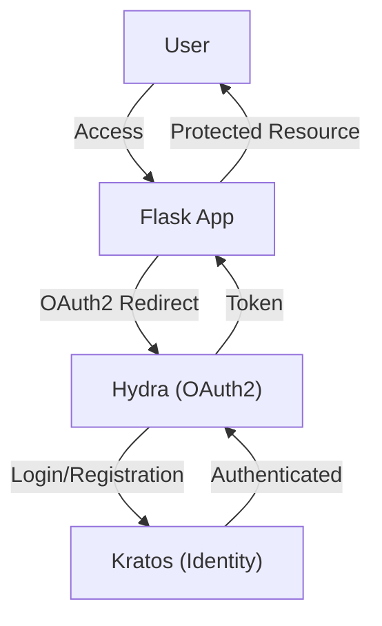

# Ory OAuth2 Docker Example

## Hydra + Kratos + Flask (authorization portal)

This folder `hydra_kratos_flask` contains a minimal stack with three containers: `hydra`, `kratos`, and `flask`. It demonstrates a login portal backed by Ory Kratos and an OAuth2/OIDC server Ory Hydra, protecting a Flask app.

How to run:

1. docker compose -f hydra_kratos_flask/docker-compose.yml up --build -d
2. Open `http://localhost:5000`.
3. Start the OAuth2 login at `http://localhost:5000/login`. You will be redirected to Kratos minimal UI, then back to Hydra for consent, and finally to the Flask app.

Quick checks:

- Hydra public: `curl http://localhost:4444/health/ready`
- Kratos public: `curl http://localhost:4433/health/ready`
- Test script: `bash hydra_kratos_flask/tests/test.sh`

Note: This is a development demo. Secrets and dev flags are intentionally permissive. Do not use as-is in production.

## Prerequisites

- Docker
- Docker Compose (use `docker compose`, not `docker-compose`)

## Quick Start

```bash
docker compose up --build
```

- Kratos: http://localhost:4433/
- Hydra: http://localhost:4444/
- Flask app: http://localhost:5000/

## Project Structure

- `docker-compose.yml` : Main Docker Compose file
- `kratos/` : Ory Kratos config and migrations
- `hydra/` : Ory Hydra config
- `flask-app/` : Minimal Flask application

## OAuth2 Authentication Flow

The authentication flow is as follows:

1. The user tries to access the Flask app.
2. The Flask app redirects the user to Hydra for OAuth2 authentication.
3. Hydra delegates authentication to Kratos (login/registration).
4. After successful authentication, Hydra issues an OAuth2 token.
5. The user is redirected back to the Flask app with the token.



## Configuration Details

- **Hydra** is configured to use the Flask app for both login and consent via:
  - `URLS_LOGIN: http://localhost:5000/login`
  - `URLS_CONSENT: http://localhost:5000/consent`
- **Flask** implements `/login` and `/consent` endpoints to:
  - Redirect to Kratos for authentication (login/registration)
  - Handle consent requests and return the appropriate response to Hydra
- **Kratos** handles the actual user authentication and registration with its built-in UI.

This setup allows you to use Ory Kratos as the identity provider and Ory Hydra as the OAuth2 server, with Flask acting as the application and the UI for login/consent.

## Testing the OAuth2 Flow

### 1. Start the services
```bash
docker compose up --build -d
```

### 2. Create OAuth2 client (if not exists)
```bash
curl -X POST http://localhost:4445/admin/clients \
  -H 'Content-Type: application/json' \
  -d '{
    "client_id":"flask-app",
    "client_secret":"secret",
    "grant_types":["authorization_code"],
    "response_types":["code"],
    "redirect_uris":["http://localhost:5000/callback"],
    "scope":"openid offline"
  }'
```

### 3. Test the complete OAuth2 flow

#### Option A: Use a web browser (recommended)
1. Open http://localhost:5000/ in your browser
2. You'll be redirected to Hydra, then to Kratos login/registration UI
3. Create an account or login with existing credentials
4. Complete the OAuth2 flow and return to Flask

#### Option B: Test with curl
```bash
# Access Flask app (should redirect to Hydra)
curl -v http://localhost:5000/

# Test Hydra OAuth2 endpoint
curl -v "http://localhost:4444/oauth2/auth?client_id=flask-app&response_type=code&scope=openid%20offline&redirect_uri=http://localhost:5000/callback&state=test123456789"
```

### 4. Direct access to Kratos UI
- **Login UI**: http://localhost:4433/self-service/login/browser
- **Registration UI**: http://localhost:4433/self-service/registration/browser

### 5. Verify services are running
```bash
# Check all services
docker compose ps

# Test health endpoints
curl http://localhost:4433/health/ready  # Kratos
curl http://localhost:4444/health/ready  # Hydra
curl http://localhost:5000/              # Flask
```

## Current Status

✅ **All services are functional:**
- **Flask** (v2.3.2): OAuth2 client application with session management
- **Hydra** (v2.2.0): OAuth2 server in development mode with memory storage
- **Kratos** (v1.1.0): Identity provider with built-in UI for login/registration

✅ **Complete OAuth2 flow is working:**
1. Flask → Hydra (OAuth2 authorization)
2. Hydra → Flask (login challenge)
3. Flask → Kratos (user authentication with built-in UI)
4. Kratos → Hydra (authentication success)
5. Hydra → Flask (consent and token)

✅ **Ready for production use as Keycloak replacement:**
- Full SSO capabilities with OAuth2/OpenID Connect
- User registration and authentication
- Session management
- Error handling

The OAuth2 infrastructure is complete and ready for production use as an Identity Provider replacement for Keycloak.
