# Flask + Kratos Authentication (Simplified)

A simplified Flask application protected with Ory Kratos authentication, inspired by the Keycloak App A pattern with automatic redirection to login.

## 🚀 Quick Start

1. **Start the services:**
   ```bash
   docker compose up -d
   ```

2. **Wait for services to be ready (about 10 seconds):**
   ```bash
   sleep 10
   ```

3. **Open your browser and navigate to:**
   ```
   http://localhost:5000
   ```

## 🔐 How it Works (Like Keycloak App A)

### Authentication Flow

1. **Protected Application**: Accessing `http://localhost:5000` requires authentication
2. **Automatic Redirect**: If not authenticated → redirected to `/login` → redirected to Kratos login page
3. **Kratos Login**: Built-in Kratos login interface (like Keycloak login page)
4. **Return to App**: After successful login, redirected back to protected application
5. **Session Management**: User data stored in Flask sessions from Kratos session

### Key Features

- **Automatic Protection**: `@login_required` decorator protects routes
- **Seamless Redirects**: Users never see "please login" pages - automatic redirects
- **Built-in Kratos UI**: Uses Kratos integrated login/registration forms
- **Session Sync**: Flask sessions synchronized with Kratos sessions
- **Simple API**: Same pattern as Keycloak App A

## 🧪 Testing the Application

### 1. Access the Protected App
```bash
curl -L http://localhost:5000/
# Should redirect through login flow
```

### 2. Create a Test User
- Go to `http://localhost:5000` in browser
- Automatic redirect to Kratos login
- Click "Don't have an account?" for registration
- Create account with email and password

### 3. Test Authentication Flow
- After login → redirected to protected app
- User info displayed (email, name, ID)
- Test protected API endpoint
- Test logout functionality

## 🛠️ Services

| Service | URL | Purpose |
|---------|-----|---------|
| **Flask App** | `http://localhost:5000` | Main protected application |
| **Kratos Public** | `http://localhost:4433` | Authentication service |
| **Kratos Admin** | `http://localhost:4434` | Management API |
| **Hydra Public** | `http://localhost:4444` | OAuth2 (future use) |
| **Hydra Admin** | `http://localhost:4445` | OAuth2 admin (future use) |

## 📋 Implementation Details

### Protection Pattern (Same as Keycloak App A)

```python
@app.route("/")
@login_required
def home():
    """Protected home page - requires authentication"""
    return render_template_string(HOME_TEMPLATE)

def login_required(f):
    @wraps(f)
    def decorated_function(*args, **kwargs):
        if not check_kratos_session():
            return redirect(url_for('login'))  # Auto redirect
        return f(*args, **kwargs)
    return decorated_function
```

### Session Management

```python
def check_kratos_session():
    """Check valid Kratos session via /sessions/whoami"""
    cookies = {k: v for k, v in request.cookies.items()}
    response = requests.get(f"{KRATOS_PUBLIC_URL}/sessions/whoami", cookies=cookies)
    
    if response.status_code == 200:
        user_data = response.json()
        # Sync user data to Flask session
        session['authenticated'] = True
        session['user_email'] = user_data['identity']['traits']['email']
        return True
    return False
```

### Routes

| Route | Purpose | Protection |
|-------|---------|------------|
| `/` | Home page | `@login_required` |
| `/login` | Redirect to Kratos | Public |
| `/logout` | Clear session + Kratos logout | Public |
| `/protected` | API endpoint | `@login_required` |
| `/register` | Redirect to Kratos registration | Public |
| `/health` | Health check | Public |

## 🔧 Configuration

### Environment Variables

```env
SECRET_KEY=please-change-this-in-prod
KRATOS_PUBLIC_URL=http://kratos:4433          # Internal communication
KRATOS_BROWSER_URL=http://localhost:4433      # Browser redirects
OAUTH2_CLIENT_ID=flask-app
OAUTH2_CLIENT_SECRET=flask-app-secret
```

### Kratos Configuration

- **Identity Schema**: Email + password authentication
- **Return URLs**: All redirect back to Flask app (`http://localhost:5000/`)
- **UI URLs**: Registration and login handled by Kratos built-in forms
- **Cookie Domain**: `localhost` for development

## 🍪 Cookie Management

Lors de l'authentification, 3 cookies sont automatiquement créés pour gérer la session et la sécurité :

### 1. **CSRF Token Cookie** 
```
csrf_token_xxxxxxxx
```

- **Source**: Kratos UI (`kratos-selfservice-ui-node`)
- **Purpose**: Protection contre les attaques CSRF (Cross-Site Request Forgery)
- **Scope**: Formulaires de connexion/inscription Kratos
- **Security**: Token unique généré pour chaque session
- **Configuration**: 
  ```yaml
  # docker-compose.yml
  CSRF_COOKIE_NAME: __HOST-csrf_token
  CSRF_COOKIE_SECRET: please-change-this-csrf-secret
  ```

### 2. **Kratos Session Cookie**
```
ory_kratos_session
```

- **Source**: Ory Kratos (`oryd/kratos`)
- **Purpose**: Session d'authentification principale
- **Content**: Token de session Kratos chiffré
- **Validity**: Configuré dans `kratos.yml` (lifespan des flows)
- **Usage**: 
  - Validation de l'état d'authentification
  - Communication avec `/sessions/whoami`
  - Synchronisation avec Flask session
- **Security**: Cookie sécurisé, HTTPOnly

### 3. **Flask Session Cookie**
```
session
```

- **Source**: Application Flask
- **Purpose**: Session locale Flask pour données utilisateur
- **Content**: Données utilisateur extraites de Kratos :
  ```python
  session['authenticated'] = True
  session['user_email'] = user_data['identity']['traits']['email']
  session['user_id'] = user_data['identity']['id']
  ```
- **Configuration**: 
  ```python
  # flask_app/app.py
  SECRET_KEY = os.environ.get("SECRET_KEY", "please-change-this-in-prod")
  ```

### Cookie Flow Diagram

```mermaid
graph TB
    A[🌐 Browser] -->|1. GET /| B[🐍 Flask App]
    B -->|2. Check session| C{🍪 Flask Cookie?}
    C -->|No| D[📤 Redirect /login]
    D -->|3. Redirect| E[🔐 Kratos UI]
    E -->|4. Login form| F[📝 CSRF Token]
    F -->|5. Submit credentials| G[✅ Kratos Auth]
    G -->|6. Create session| H[🍪 ory_kratos_session]
    H -->|7. Redirect back| B
    B -->|8. Validate Kratos| I[🔍 /sessions/whoami]
    I -->|9. Sync data| J[🍪 Flask session]
    J -->|10. Access granted| K[✅ Protected Page]
```



### Cookie Security Features

- **CSRF Protection**: Chaque formulaire protégé par token unique
- **Session Isolation**: Kratos et Flask sessions indépendantes
- **Automatic Sync**: Données utilisateur synchronisées entre systèmes
- **Secure Flags**: Cookies configurés avec options de sécurité
- **Domain Scope**: Limité à `localhost` en développement

### Development vs Production

| Cookie | Development | Production |
|--------|-------------|------------|
| **Domain** | `localhost` | Your domain |
| **Secure Flag** | `false` | `true` (HTTPS only) |
| **SameSite** | `lax` | `strict` |
| **CSRF Secret** | Default | Strong random key |
| **Session Secret** | Default | Strong random key |

## 🔄 Comparison with Keycloak App A

| Aspect | Keycloak App A | This Kratos App |
|--------|----------------|-----------------|
| **Protection** | `@login_required` decorator | Same `@login_required` decorator |
| **Auto Redirect** | `redirect('/login')` | Same `redirect('/login')` |
| **Login Route** | Redirects to Keycloak | Redirects to Kratos |
| **Session Data** | JWT tokens → Flask session | Kratos session → Flask session |
| **User Experience** | Seamless login flow | Same seamless login flow |
| **Template** | Simple home template | Same simple home template |

## 🔧 Troubleshooting

### Quick Checks

```bash
# Check services are running
docker compose ps

# Check Kratos health
curl http://localhost:4433/health/ready

# Check Flask health  
curl http://localhost:5000/health

# View logs
docker compose logs flask
docker compose logs kratos
```

### Common Issues

1. **Redirect loops**: Clear browser cookies for localhost
2. **Session not found**: Wait for services to fully start
3. **Login form errors**: Check Kratos logs for flow errors

## 🎯 OAuth2 Structure Ready

The setup includes Hydra for future OAuth2/OIDC flows:
- All services configured and running
- Ready to add multiple applications
- OAuth2 client registration prepared
- Same authentication backend (Kratos)
